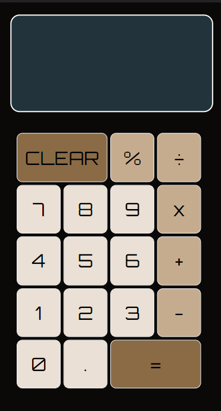
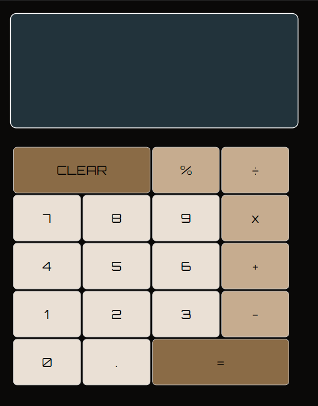
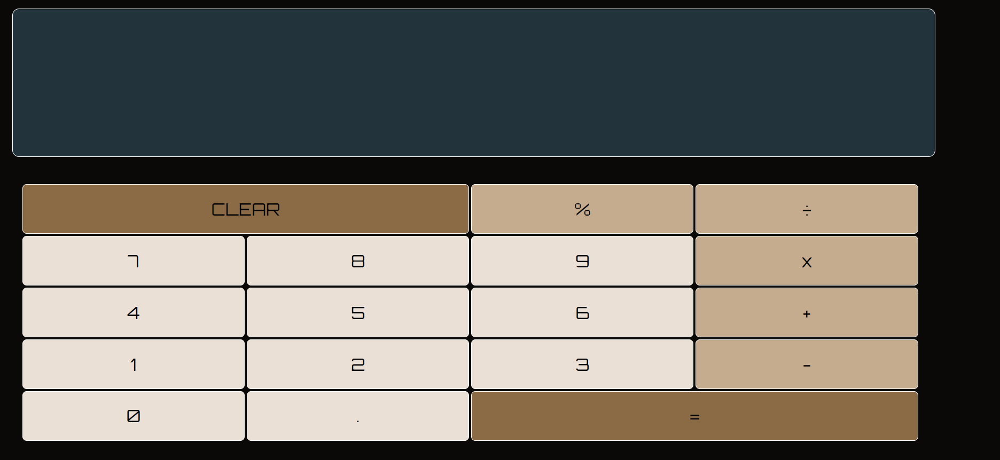

# CALCULATOR CHALLENGE
This calculator project tested my understading of JavaScript fundamentals, DOM Manipulation, HTML and SASS (SCSS) 
knowledge as well as getting practice using command line and GitHub flow.

ABOUT
===
This calculator was created with:

* UI design : HTML and SASS (SCSS and then compiled to CSS, BEM notation for SASS)
* Functionality : JavaScript
* E2E tests with Cypress

It has a responsive design for : 
* Mobile devices up to 768px
* Tablets and small laptops up to 1024px
* PC monitors or larger devices from 1024px

My inspiration for the design comes from these posts on Muzli. 
* https://search.muz.li/MWUxZmI2Nzdh (layout)
* https://search.muz.li/ZWFjZDliZTk0 (buttons distribution)

FUNCTIONALITY 
===
This calculator can be used as follows:

* Take up to 2 number inputs and a operator: e.g. 2+2, 2457-61245
* The calculation will show on screen after pressing "=" (Equal Button);
* To write a new operation, use the "clear" button first.

FEATURES
===
With this calculator you can :
* Add(+) 2 numbers
* Substract(-) 2 numbers
* Multiply(x) 2 numbers
* Divide(÷) 2 numbers
* Calculate percentage (%) of 1 number
* Decimal number operations
* Clear the Screen (Clear)

PREVIEW 
===
Mobile device:  

 
Tablet device:  

 
PC monitor or larger:  

